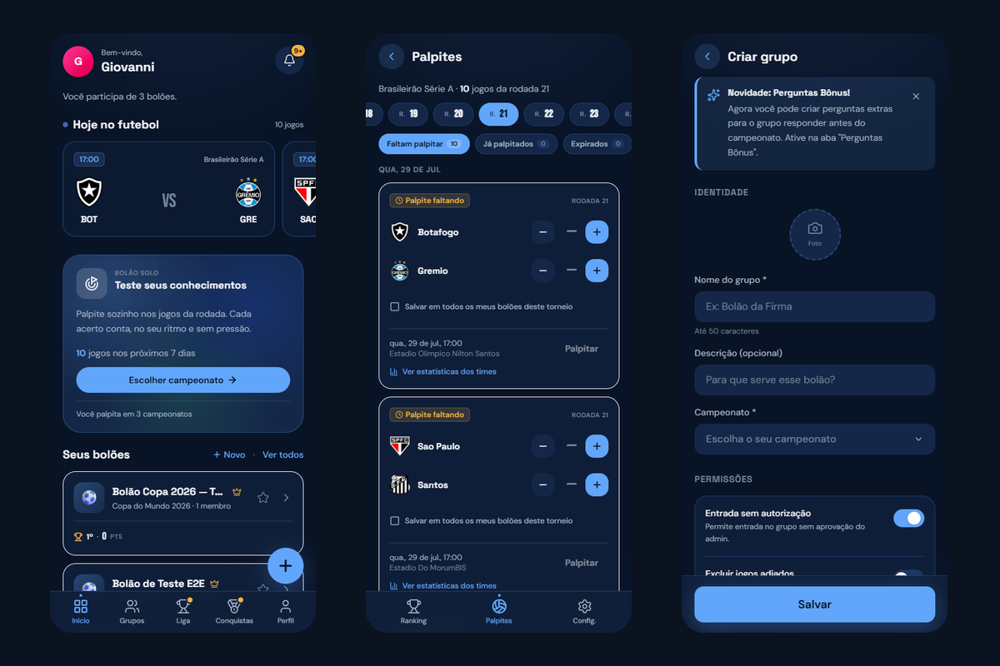
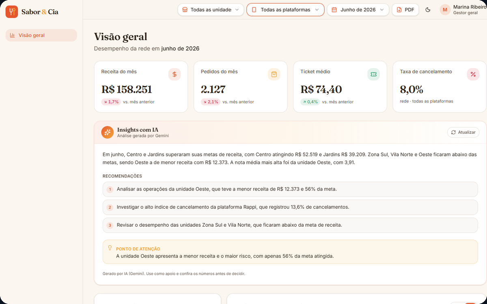
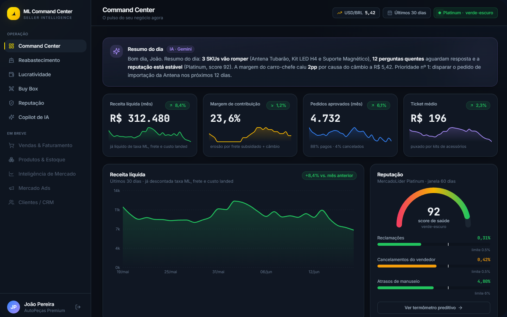

 

  [_99681--0270-25D366?style=for-the-badge&logo=whatsapp&logoColor=white)](https://wa.me/5515996810270)

---

## Sobre

Desenvolvedor front-end, 26 anos, interior de São Paulo. Trabalho remoto.

Meu diferencial não é decorar sintaxe: é **entregar produto inteiro sozinho**. Pego um
briefing vago, transformo em escopo, desenho a interface, escrevo o código, modelo o
banco, subo em produção e continuo dando manutenção. Uso IA de forma pesada e deliberada
para acelerar isso, e sou aberto sobre o assunto, porque o mérito não está na digitação:
está em saber **o que** construir, **por que** aquela decisão, e em revisar cada linha
antes dela ir pro ar.

O que me define de verdade é ser detalhista. O espaçamento errado me incomoda, o estado
de loading que ninguém pensou me incomoda, o formulário que não diz o que deu errado me
incomoda. É o que faz meus projetos parecerem caros.

**Atualmente:** desenvolvedor front-end na Lasy AI (remoto), com mais de 20 aplicações em
produção, e tocando projetos próprios de web e produto.

---

## Stack

<table>
<tr>
<td><b>Front-end</b></td>
<td>React 19, Next.js (App Router, Server Actions), TypeScript strict, Tailwind, shadcn/ui, Radix, Framer Motion</td>
</tr>
<tr>
<td><b>Back-end e dados</b></td>
<td>Supabase (Postgres, Auth, RLS, RPC), migrations versionadas, Cloudflare R2, edge functions</td>
</tr>
<tr>
<td><b>Produto</b></td>
<td>Escopo a partir do briefing, arquitetura de informação, UX de conversão, copy que vende</td>
</tr>
<tr>
<td><b>IA aplicada</b></td>
<td>Claude Code, Cursor, Vercel AI SDK, Gemini. Copilotos e insights dentro do produto, não só na escrita do código</td>
</tr>
<tr>
<td><b>Infra</b></td>
<td>Vercel, cron jobs, Web Push VAPID, Playwright, CI de build</td>
</tr>
</table>

---

## Projetos em destaque

### ⚽ [Bolão da Galera](https://github.com/giovannicdbusiness/bolao-app)

> PWA full-stack de bolão esportivo. Em produção, com wrapper nativo para Android e iOS.

Grupos privados, palpites em jogos reais, ranking ao vivo e push. A parte difícil não é a
tela: é garantir que ninguém palpite depois do apito inicial (validado por RLS no
Postgres, não no front), que a pontuação seja idêntica pra todo mundo (engine pura com 18
testes que rodam antes de cada build) e que o cron de 5 em 5 minutos não mande a mesma
notificação duas vezes.

`Next.js 16` `React 19` `TypeScript strict, zero any` `Supabase + RLS` `27 migrations` `Web Push VAPID` `5 cron jobs` `Flutter`

**[▶ bolaodagalera.pro](https://www.bolaodagalera.pro)**

 

### 🏥 [Rede Evolução](https://github.com/giovannicdbusiness/clinica-evolucao-site)

> Site de conversão para rede de clínicas de reabilitação. **Cliente real.**

Quem chega nesse site quase nunca é o paciente: é a mãe, a esposa, o irmão, em crise, no
celular. Isso definiu tudo. O formulário de triagem não manda e-mail pra uma caixa que
alguém abre na segunda: monta a mensagem e abre o WhatsApp da unidade certa já
preenchido. Cinco marcas (a rede e as 4 unidades) rodam na mesma base de código, cada uma
com tema, galeria, FAQ e telefone próprios.

`React 19` `TypeScript` `Vite` `Tailwind 4` `Framer Motion` `edge function`

**[▶ clinicaredeevolucao.com.br](https://www.clinicaredeevolucao.com.br)**

 

### 🍽️ [Sabor & Cia](https://github.com/giovannicdbusiness/sabor-vision)

> Painel operacional multi-tenant para uma rede de dark kitchens.

Dois perfis, duas visões, os mesmos dados protegidos por RLS no banco: o gestor vê a rede
inteira, o gerente vê só a unidade dele. Metas, pedidos, cancelamentos, ranking e insights
escritos por IA. Nasceu de um teste técnico e virou produto.

`TanStack Start` `React Query` `Supabase + RLS` `Recharts` `Gemini`

**[▶ ver o painel](https://sabor-e-cia-eight.vercel.app)** (credenciais de demo no README do projeto)

 

### 📦 [ML Command Center](https://github.com/giovannicdbusiness/ml-command-center)

> CRM analítico AI-native para sellers do Mercado Livre.

O painel do Mercado Livre responde "quanto vendi?". Ninguém perde dinheiro por não saber
isso. Perde por romper o estoque com lead time de 75 dias, por ver a margem evaporar no
câmbio e por perder o Buy Box sem notar. Cada tela aqui termina numa ação com prazo e
valor em reais.

`Next.js 15` `Recharts` `Vercel AI SDK` `Gemini 2.5 Flash` `seed determinística`

**[▶ ver a demo](https://app-ml-two.vercel.app/login)**

---

## Atividade

A maior parte do meu trabalho vive em repositórios privados de clientes e produto. 
Os quatro projetos acima são o que eu posso mostrar por inteiro, código e tudo.

---

### Aberto a oportunidades

Vagas remotas de front-end e projetos freelance de web e produto.

 

